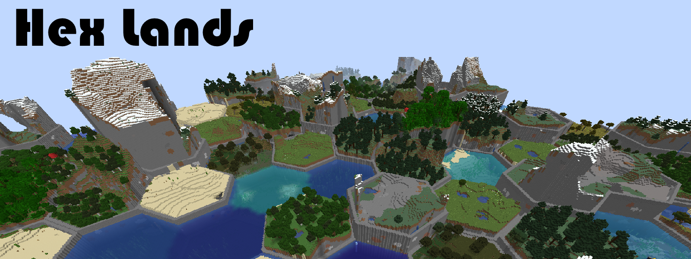
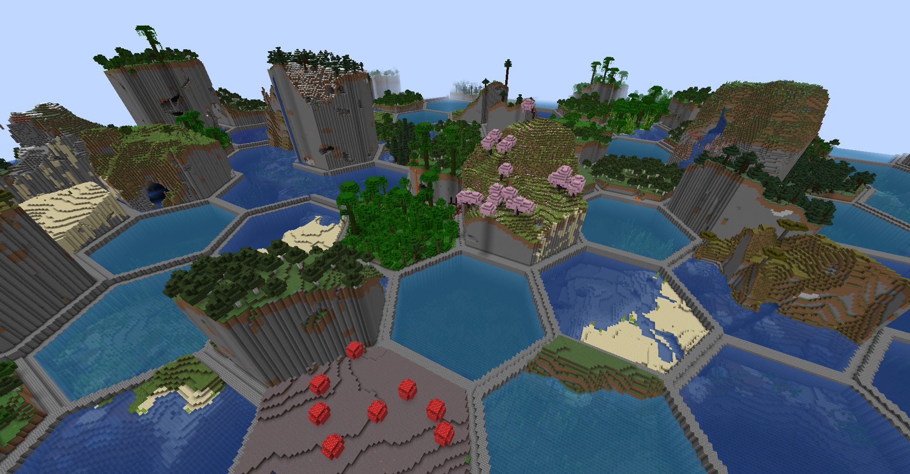
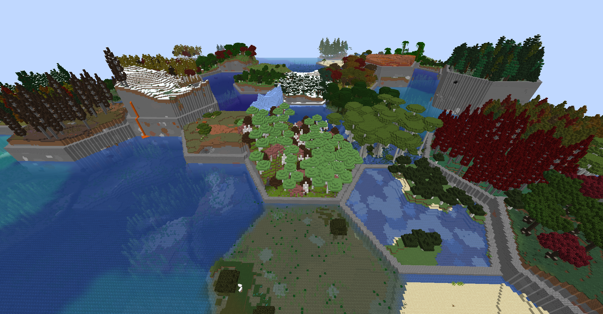
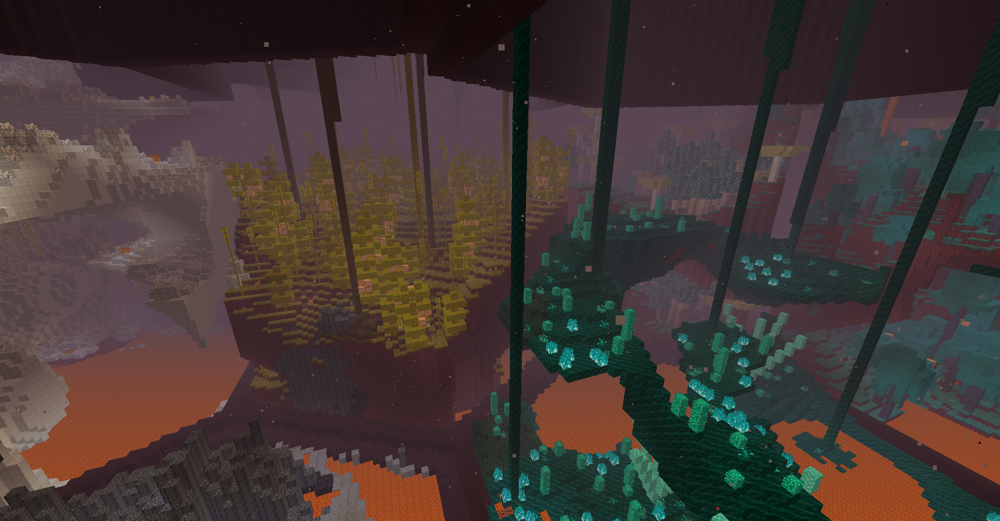
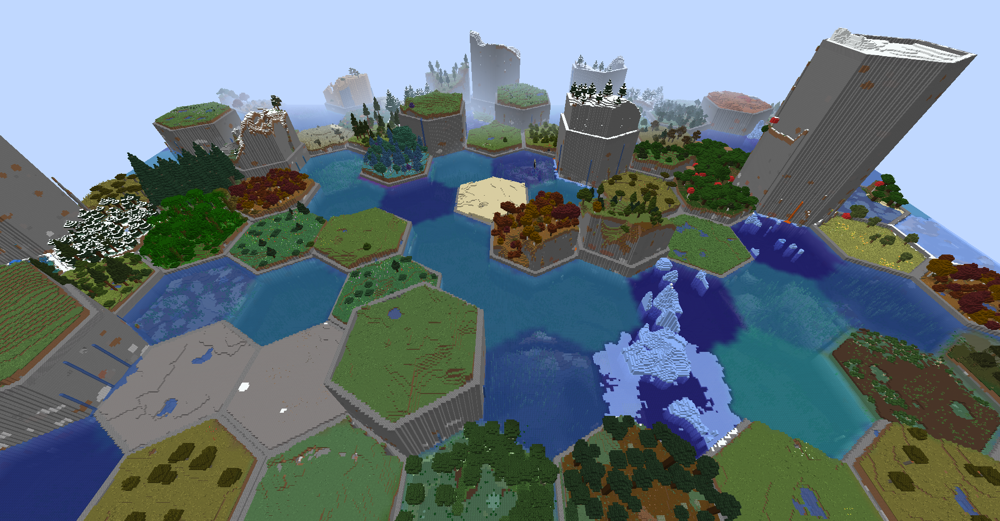

This mod is an updated and rewritten version of the original [Hex Lands](https://www.curseforge.com/minecraft/mc-mods/hex-lands) mod by superfluke, et. al. It has been re-done completely from scratch (three times now) since Minecraft 1.16.5.

### Features

- Adds two world type presets: "HexLands", and "HexLands (Overworld)". The former which enables hexagonal terrain generation in both the overworld and the nether, the latter which only enables it in the overworld.
- Each hex contains a single biome. Hexes of different types are bordered by walls.
- Automatic compatibility with mods that add biomes to the overworld or other world generation.
- Many options for world customization via data packs.

### Configuration (Data Packs)

All of HexLands's world generation can be used by datapacks. If you're not familiar with world gen datapacks and custom dimensions, the following articles are useful to get up to speed:

- [Custom World Generation](https://minecraft.fandom.com/wiki/Custom_world_generation)
- [Custom Dimensions](https://minecraft.fandom.com/wiki/Custom_dimension)

In order to change a dimension to use hex based generation, you need to override the [dimension](https://minecraft.fandom.com/wiki/Custom_dimension#Dimension_syntax) json. For example, in the overworld, this would be `data/minecraft/dimension/overworld.json`. This is used in the `generator` field of a dimension json. It is an object, which has the following fields.

**Note**: Anywhere below where the term "default value" is used does not mean the field is not required! It means that is the value used by the Hex Land's generation presets.

- `type` is a string identifying what chunk generator to use. It should be `hexlands:hexlands`.
- `seed` is an integer. It is the seed of the world.
- `settings` is a [Noise Settings](https://minecraft.fandom.com/wiki/Custom_world_generation#Noise_settings) used by the dimension. The default value is `"minecraft:overworld"`.
- `hex_settings` is an object with parameters defining how the hexagonal grid works. It can have any of the following fields:
    - `biome_scale` (Default: 8) is the scale at which biomes are sampled to create hexes. Higher values create more random biome layouts.
    - `hex_size` (Default: 40) is the size of an individual hex.
    - `hex_border_threshold` (Default: 0.92) is a number between `0` and `1` representing how much of a hex should be covered by the border. Larger values will lead to thinner borders.
    - `top_border` and `bottom_border` are both border settings which define how the top and bottom borders of the world are built. The borders between hexes consist of a bottom border, air, and a top border. If not present, this section of the border will consist entirely of air. If present, it must have the following fields:
        - `min_height`: The minimum height of the border.
        - `max_height`: The maximum height of the border.
        - `state`: A block state to generate as the border state. As in vanilla formats, this must be an object with a `Name` and `Properties` field. The `Properties` must be an object containing **all** possible block state properties in key-value pairs, and the `Name` field must be the name of the block.
- `biome_source` is the biome source, as in vanilla. It can be a known preset, such as `"minecraft:overworld"`, or `"minecraft:nether"`, or it can be a JSON object following the vanilla biome source format (an example of [vanilla's overworld biome source in full](https://github.com/misode/vanilla-worldgen/blob/af187cddb2d4a808b17c1d45c17d75dbfc218ad3/dimension/overworld.json)).
- `forge:use_server_seed` is a boolean (Forge only). If `true`, then the `seed` parameter is ignored, and the seed is used from either the create world screen, or server.properties.

### Example

```json5
// An example of overriding a vanilla dimension
{
  // The dimension type
  "type": "minecraft:overworld",
  "generator": {
    // The type of the chunk generator
    "type": "hexlands:hexlands",
    "seed": 0,
    "settings": "minecraft:overworld",
    "hex_settings": {
      "biome_scale": 8,
      "hex_size": 40,
      "hex_border_threshold": 0.92,
      "bottom_border": {
        "min_height": 62,
        "max_height": 65,
        "state": {
          "Name": "minecraft:stone_bricks",
          // Stone Bricks has no properties, so we have an empty object here. 
          "Properties": {}
        }
      },
      // No "top_border" field indicates the border should be just air, as is in the overworld
    },
    // This is a biome source object as declared in vanilla
    // It can be either 'minecraft:overworld', or 'minecraft:nether' for the default overworld and nether biome sources
    // Or, it can be a completely custom biome source - however this may be very long (the default vanilla biome source is ~300,000 lines long)
    "biome_source": "minecraft:overworld",
    "forge:use_server_seed": true
  }
}
```

### Gallery




With [Oh The Biomes You'll Bo](https://www.curseforge.com/minecraft/mc-mods/oh-the-biomes-youll-go):





With [Biomes O Plenty](https://www.curseforge.com/minecraft/mc-mods/biomes-o-plenty)




